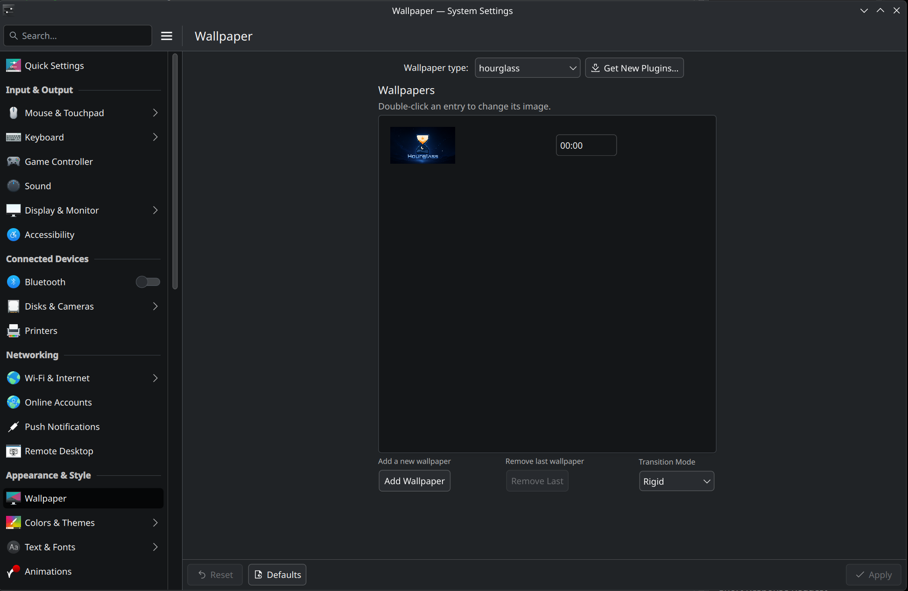

# Hourglass

Hourglass is a KDE Plasma 6 Wallpaper Plugin that allows you change your wallpaper based on the time of day (24 hour format). It uses new Date() function which uses your computer time instead of absolute time, which means it can be used without an internet connection. It only supports static images. It features two transition modes:

## Transition Modes

- Rigid
Switches to next image as soon as the time as reached

- Smoothe
Gradually fades to next image continously. If you want your wallpaper to stay the same image for a set time before it starts fading, you can add the same image twice and the first time will be the time the image stops fading from previous image, and the second time will be the time the image starts fading into the next one.

## How to Install

Install via the KDE Plasma 6 official store

## How to Use

The above image shows the plugin interface. The wallpaper window has all wallpaper images displayed with the time they are set at (it is in 24 hour time, so 00:00 = 12:00 AM, 21:00 = 9:00 PM, etc)

The plugin updates every minute, which means that when you make changes to your wallpaper configuration it can take up to 1 minute to actually see the changes on your desktop wallpaper.

I have done my best to prevent you from putting in any invalid time or inputs that could break the plugin, but I am not perfect so I will list the rules below:
- Wallpapers must be ordered with earliest time at the top, and latest time at bottom
- Wallpapers can only be added or removed from the end of list (latest time wallpaper) ((I am aware this can be kind of a pain, but it was the easiest way to make the program safe))

Operating the program is as follows:
- to change a wallpaper's image on the list, click its image
- to change a wallpaper's time click its time and type in desired time in HH:MM format (program will correct errors with previous entry)
- to the last wallpaper on list, click remove Last (the list must contain at least one image, so this button is disabled if you have only one entry in the list)

Hourglass
Copyright (C) 2026 John Smeds

This project is licensed under the GNU General Public License v3.0.
See the LICENSE file for details.
